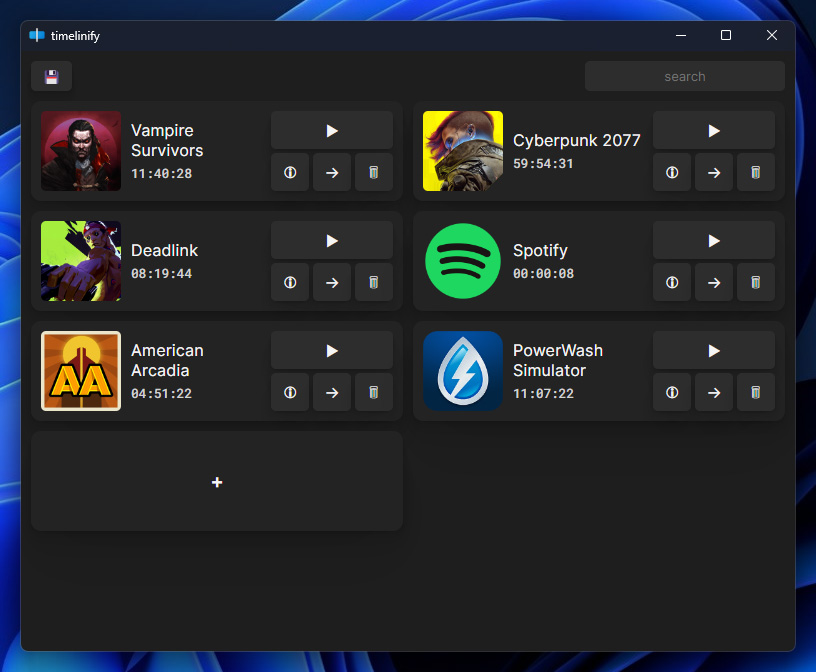

# timelinify

An app to track usage time of apps (mostly games) with session details

## Build Instructions
If you wish to run a development build of **timelinify**:

- Download or clone
- Install [`nodejs`](https://nodejs.org/en/download)
- Install [`Rust`](https://www.rust-lang.org/tools/install)
- Run `npm install` to install **node** dependencies
- Run `cargo fetch` to install **rust** dependencies
- Execute the instructions from the [`exe_icon!!!.txt`](./exe_icon!!!.txt) file
- Run `gulp release` to build front page
- Run `npm run tauri build` to build an executable or `npm run tauri dev` to run a development build

## Thanks
- [jQuery](https://github.com/jquery/jquery)
- [Fuse.js](https://github.com/krisk/fuse)
- [vis-timeline](https://github.com/visjs/vis-timeline)
- [Inter](https://github.com/rsms/inter)
- [Roboto Mono](https://fonts.google.com/specimen/Roboto+Mono)